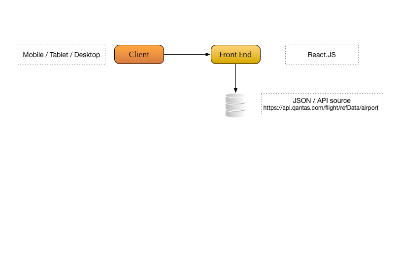

# CMS Front End Application #

The Front End Application was developed as a Single Page Application, and is performing client rendering (as opposed to Server Side Rendering).

Project is fetching data via [fetch](https://developer.mozilla.org/en-US/docs/Web/API/Fetch_API), for some devices we may need to use
a [polyfill](https://github.com/github/fetch)

An alternative would be to use [Axios](https://github.com/axios/axios) but we would lose the ability to intercept requests in the 
Service Worker if required.

We are not employing any of the [PWA](https://developers.google.com/web/progressive-web-apps) (Progressive Web App) improvements at this 
stage of the project.

## Architecture Diagram ##



### Styling ###

Project is using [Bulma](https://bulma.io) for styling, which is based on Flexbox, providing responsiveness

### Accessibility ###

Project does not specifically tackle [Accessibility](https://www.w3.org/standards/webdesign/accessibility) in this instance

### Caching ###

At the moment, Project loads data on the first load, and stores API result into redux, via [Redux Thunk](https://github.com/reduxjs/redux-thunk)

An alternative for Redux would be to use [Redux Saga](https://github.com/redux-saga/redux-saga) 

Another, possibly better approach would be to cache the result by intercepting fetch API calls via the Service Worker via PWA.

### CORS ###

We are using create-react-app proxy feature to work around CORS in the development mode.

### Atomic Design ###

In general, [Atomic Design](http://bradfrost.com/blog/post/atomic-web-design) works well with larger React Apps, in this instance we 
used minimal amount of components.

### Dependencies ###

Project Assumptions: You already have yarn or npm installed already, you can view
[command comparison](https://yarnpkg.com/lang/en/docs/migrating-from-npm)

We are showing yarn commands below, but npm can be also used.

Please run
```bash
yarn install
```

### How to Run ###

```bash
yarn start
```

Navigate to http://localhost:3000 in your browser

### How to Build ###

To build

```bash
yarn build
```

You can find the optimised bundle in the dist folder.

### Testing ###

To test Components, please run tests as below

```bash
yarn test
```

Currently, only simple tests have been implemented, typically, we should do:
* TDD [Test Driven Development](https://en.wikipedia.org/wiki/Test-driven_development)
* BDD [Behavior Driven Development](https://en.wikipedia.org/wiki/Behavior-driven_development)
